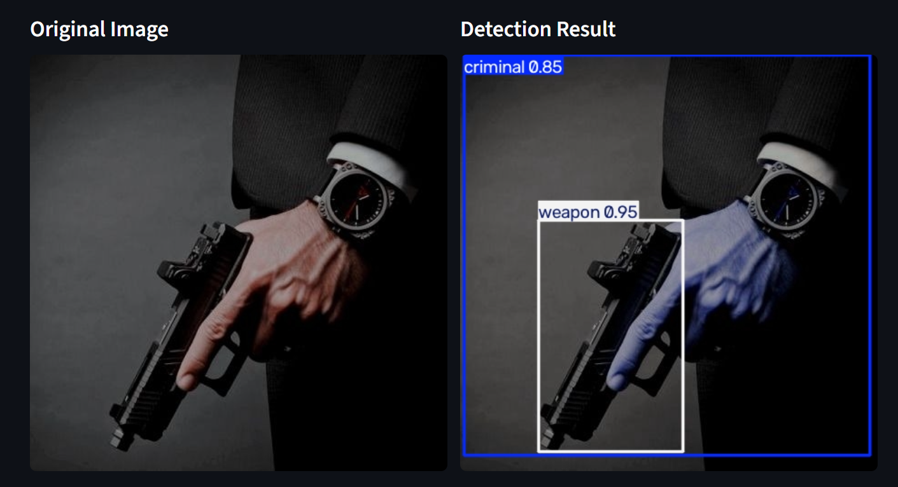

# 🎯 Object Detection with YOLO11

## 📌 Project Overview

This project implements an **Object Detection system using YOLO11**.

The goal is to train a YOLO object detection model and build an interactive **Streamlit** interface that allows users to upload an image and automatically detect objects inside it.

The application displays:

- Original image
- Detection result with bounding boxes
- Detected class names
- Confidence scores
- Bounding box coordinates
- Total number of detected objects
- Detected objects by class

## 🧠 Model

The project uses **YOLO11** from Ultralytics for object detection.

The trained model weights are expected at:

```text
runs/
└── detect/
    └── train/
        └── weights/
            └── best.pt
```

## 🏷️ Detected Classes

The classes are determined by the trained dataset/model.

Example detections include:

- `criminal`
- `weapon`

## 🖼️ Detection Result

Example of the model detecting a **criminal** and a **weapon**:



## 🗂️ Project Structure

```text
Object-Detection/
│
├── app.py
├── main.py
├── README.md
├── detection_result.png
└── best.pt
```

### `main.py`

Contains the object detection logic:

- Loads the trained YOLO model
- Runs inference
- Extracts detected classes
- Extracts confidence scores
- Extracts bounding boxes
- Generates the annotated image

### `app.py`

Contains the **Streamlit web application** with:

- Image upload
- Camera input
- Confidence threshold
- Original vs. detection result
- Detection results table
- Object count
- Class distribution chart

## ⚙️ Installation

Install the required packages:

```bash
pip install ultralytics streamlit pandas pillow
```

## 🚀 Running the Application

Make sure the trained model exists at:

```text
runs/detect/train/weights/best.pt
```

Then run:

```bash
streamlit run app.py
```

## 🔍 How It Works

```text
Input Image
     ↓
YOLO11 Model
     ↓
Object Detection
     ↓
Bounding Boxes
     ↓
Class + Confidence
     ↓
Annotated Image
     ↓
Streamlit Interface
```

The confidence threshold can be adjusted from the sidebar.

## 📊 Detection Output

| Information | Description |
|---|---|
| Class | Detected object category |
| Confidence | Model confidence score |
| x1 | Left coordinate |
| y1 | Top coordinate |
| x2 | Right coordinate |
| y2 | Bottom coordinate |

## 🛠️ Technologies Used

- Python
- YOLO11
- Ultralytics
- Streamlit
- Pandas
- Pillow
- Computer Vision
- Object Detection

## 🎯 Task Objective

This project demonstrates the complete object detection workflow:

1. Prepare an object detection dataset.
2. Train a YOLO11 model.
3. Save the best trained weights.
4. Load the trained model for inference.
5. Detect objects in new images.
6. Visualize bounding boxes and confidence scores.
7. Deploy the model through an interactive Streamlit application.

## 👤 Author

**Engi Eid**

Computer Science Student | Machine Learning & Computer Vision
